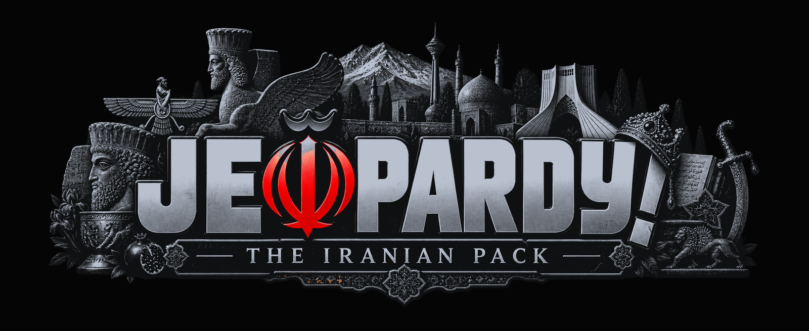

# JEOPARDY! — Iranian Edition

Ask an Iranian about Iranian history and the answer comes immediately. Ask the next
Iranian and the answer is different, and just as immediate. This game is built on that.

Three contestants, six categories a round, one buzzer each. Single Jeopardy, Double
Jeopardy, a Daily Double hiding in each round, and a Final where you wager before you see
the clue. The categories are the ones people actually fight about: empires that fell
apart, revolutions that went sideways, poets, oil, and whatever your uncle is so sure
about.

Play it in a browser: <https://aghamorad.github.io/jeopardy-iranian-edition/>

## One game, two languages

At the splash you choose a language, and everything downstream follows: the menus, the
board, the clues, the rulings, the host's snark. Persian is the same show with the same
4,167 clues written right-to-left in IRANSansWeb. It carries a `[BETA]`
seal while the host is still speaking English.

It is one build. There is no separate Persian download, and no version of the game that
is missing it.

## Two ways to answer

Chosen per match, in the green room:

- **Multiple choice** — four options, pick one.
- **Write-in** — type it. Judged generously, because Persian spells the same name more
  than one way. Typos are forgiven, a dropped article is forgiven, a surname on its own
  is accepted, and if the name you gave belongs to a real person who merely isn't the one
  asked for, the host cuts in and asks which one you meant rather than ruling you wrong.

## Robots who have opinions

The other two seats don't have to be human. Three robots will take them, at any of four
difficulties — *Cable Access*, *Nostalgia*, *Your Uncle*, *The Archive*. They buzz, they
answer, they wager, they get locked out, and they are not above a bad guess.

## Take it with you

Four builds, all on the [Releases page](https://github.com/aghamorad/jeopardy-iranian-edition/releases/latest):

| File | Size | Runs on |
| --- | --- | --- |
| `Jeopardy-Iranian-Edition-macOS-universal.zip` | 32 MB | macOS 14 or later, Intel or Apple silicon |
| `Jeopardy-Iranian-Edition-iOS.ipa` | 33 MB | iOS or iPadOS 17 or later, iPhone and iPad |
| `Jeopardy-Iranian-Edition-Android.apk` | 32 MB | Android 7.0 or later |
| `Jeopardy-Iranian-Edition-web-beta-N.zip` | 11 MB | any browser — unzip and open `index.html` |

The first three are the web show in a native shell, so they carry the same `Web/` tree the
zip does. Take the zip if you want the show without installing anything.

Same clue bank, music, host voice, and icon in all four versions. The
Mac one has both architectures inside a single binary. The iPhone one is the entire show
packed up; it never asks the network for anything.

The one place the three are not interchangeable is the buzz in your hand. No version of
Safari has ever had a Vibration API, so in a browser on an iPhone the buzz is drawn and
sounded but never felt. The native build answers the page with the platform's own feedback
generator instead: a heavy knock when you take the floor, a light one when somebody beats
you to it, iOS's error pattern when you jump the lamp. Android browsers feel it either way.

### Installation and signing

The Mac app is ad-hoc signed but not notarized. On a Mac, Gatekeeper may still ask for
confirmation: right-click the app, choose **Open**, then **Open** again in the dialog. Or
clear the flag once:

```bash
xattr -dr com.apple.quarantine "/Applications/Jeopardy Iranian Edition.app"
```

The Android APK is self-signed and installable directly. Android will ask you to allow the
browser or file manager to install unknown apps. Keep the same APK signing key for future
updates; a differently signed APK cannot update this one in place.

On an iPhone the `.ipa` will not install by dragging it into Finder. It is unsigned and has
to be re-signed with an Apple ID first, which is what the tools below are for.

### Getting the .ipa onto an iPhone

Pick the one that fits the computer you actually have:

- **[SideStore](https://sidestore.io)** — signs on the phone itself. Set it up once with a
  computer, then install and refresh from the device, no cable again. Closest thing here to
  a normal app.
- **[AltStore](https://altstore.io)** — the original. Wants AltServer running on a Mac or PC
  on the same Wi-Fi whenever you install or refresh.
- **[Sideloadly](https://sideloadly.io)** — no app on the phone at all. Plug it in, drop the
  `.ipa` on the window, type your Apple ID, and it signs and installs over the cable. Least
  setup, most repetition.
- **[LiveContainer](https://github.com/LiveContainer/LiveContainer)** — one host app that
  runs the `.ipa` inside it, so the game doesn't eat one of your three app slots.

All of them want a free Apple ID, and a free Apple ID comes with two rules: the app dies
after **seven days** and has to be refreshed, and you get **three** sideloaded apps at a
time. If your iOS version is inside
[TrollStore](https://github.com/opa334/TrollStore)'s range, use that instead. It signs
permanently and every caveat above stops applying.

Use your own Apple ID. Signing someone else's app with yours is a fine way to lose your
account.

## The clues have receipts

There are 4,167 clues in each language. Every one carries the work it came from, the
author, the page, and the passage the clue was pulled out of. A source page without a
printed section heading keeps its chapter field empty rather than inventing a label.

Fifty books are behind that bank, shelved by period:

| Shelf | Books |
| --- | --- |
| General history, multi-era | 4 |
| Safavid, Afsharid & Zand, 1501–1796 | 3 |
| Qajar & Constitutional, 1796–1925 | 3 |
| Pahlavi & Mosaddegh, 1925–1979 | 10 |
| Revolution & Islamic Republic, 1979–present | 9 |
| Biographies & memoirs | 8 |
| Society, culture & ideas | 12 |
| New additions, 2026-09 | 1 |

The bank runs across 886 categories and 4,167 clues, from Safavid chronicles to cinema
history to the 1953 coup. Single-round clues are worth 10 to 200 million toman; the Double
round runs from 20 to 200.

## One game, three front ends

The show is a build-free static web build under `Web/`, which plays on its own in a
browser. The macOS and iOS apps are native shells wrapped around that same tree. One show,
three ways to open it.

| Path | What it is |
| --- | --- |
| `GameEngine/` | A Swift rules engine. **Neither app imports it** — only `Tests/` does. See `ARCHITECTURE.md`. |
| `App/` | The macOS and iOS shell: three Swift files wrapping a web view. |
| `App/Resources/` | The app icon, plus a legacy store of stage art and sounds. Only `AppIcon.icns` is used. |
| `QuestionBank/` | MAIN's materialized archive and append-only batch ledger. |
| `Tests/` | Test runner. An executable target, not XCTest. |
| `iOS/` | iOS shell. Generated from `project.yml`. |
| `Web/` | Static web build. Desktop and mobile. No build step. |
| `Web/courses/` | The courses, one self-contained folder each: registration, skin, two banks, art. |
| `Course/` | The authoring lab for a course — template, converter, spec. Nothing here ships. |
| `Versions/` | The web build frozen, one folder per release. Kept so a working show can be got back to. |
| `Tools/`, `script/` | Build and content tooling. |
| `Sources/` | The books the clues came from, in `MAIN CORPUS/` and `COURSES/`. **Not in the repo.** See below. |

## Building it on macOS

Needs macOS 14 or later and Swift 5.9 or later.

```bash
./run_game.sh
```

That compiles a release build, assembles `dist/Jeopardy Iranian Edition.app`, and launches
it. To get the bundle without the launch:

```bash
./build_release.sh
```

Tests:

```bash
./run_tests.sh
```

## Freezing a version

Every release also freezes the web build under `Versions/`, so a show that worked can
always be got back to even if `Web/` goes sideways later. Names only go forward — the
script refuses to overwrite a folder that already exists.

```bash
./snapshot_web.sh beta-3
```

## iOS

The Xcode project is generated, not committed, so `*.xcodeproj` stays gitignored and
cannot drift away from the spec that produces it.

```bash
brew install xcodegen
cd iOS && xcodegen generate
```

Then open `iOS/JeopardyIranianEdition.xcodeproj`. The app icon, the asset catalog and the
Info.plist are committed. Only the project file is generated.

## Web

`Web/` is the same show with no build step: plain HTML, CSS and JavaScript, the same
clues and scoring and audio as the Swift app. Double-click `index.html` and it runs off
`file://`, because the clue bank is embedded as `window.CLUES` instead of fetched over
HTTP. The layout changes between laptop and phone; both touch and keyboard work.

To serve it:

```bash
python3 -m http.server 8788 --directory "Web"
```

Then open <http://localhost:8788>.

`Web/data/clues.js` is a derived copy of `QuestionBank/verified_clues.json` — the same
clues re-serialised as `window.CLUES`, written out by
`Tools/render_bank.py` through a fixed field map, so the two cannot drift. Edit
the archive and regenerate; a hand edit to the play file is overwritten.
`Web/data/clues_fa.js` does the same for the Persian bank as
`window.CLUES_FA`. `Web/i18n.js` holds every string in both languages, in two tables kept
at exact parity. `Web/answers.js` is the write-in judge. `Web/assets/beta-stamp.svg` is the
seal that marks the Persian edition.

The courses live under `Web/courses/`, one folder per course, and each carries its own two
banks under globals of its own — `window.COURSE_CLUES_<ID>` and `..._FA`. The engine deals
a show only the array it registered, so MAIN plays only MAIN and a course plays only
itself. Which bank you are writing, and how to add a course, is in [AGENTS.md](AGENTS.md).

Both editions ship in every build. The app bundles copy the whole `Web/` tree unmodified, so
the macOS and iOS apps carry the Persian edition, and every course, exactly as the web
build does.

The design contract — palette, type stacks, geometry, components, and the look that is
permanently discarded — is [STYLE_SHEET.md](STYLE_SHEET.md).

## Controllers

Plug in one controller per contestant. The first one is Player 1, the second is Player 2,
and so on, and each controller buzzes for its own player only. Every controller also
drives the menus and the board: d-pad or left stick to move, A to choose, B to go back,
Start for the match menu.

## What is not in this repo

`Sources/` is 1.2 GB of the books the clues were written from — `MAIN CORPUS/` for the main
game, `COURSES/` for the course readings — and they are copyrighted, and several of them
sit close to GitHub's per-file limit. So they stay on my disk. Everything you need to
build and play is here. Everything you need to write new clues is not.
